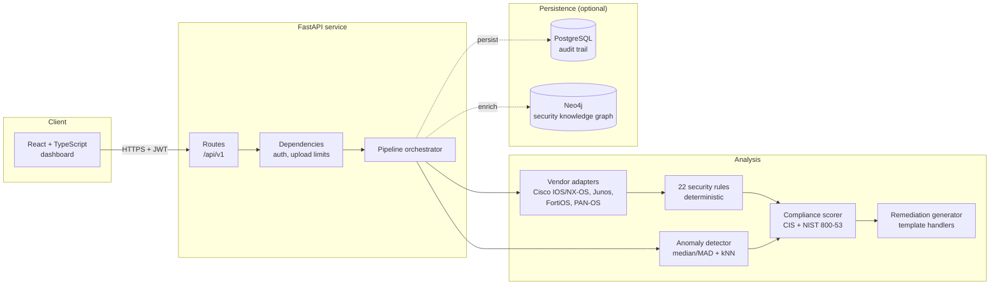
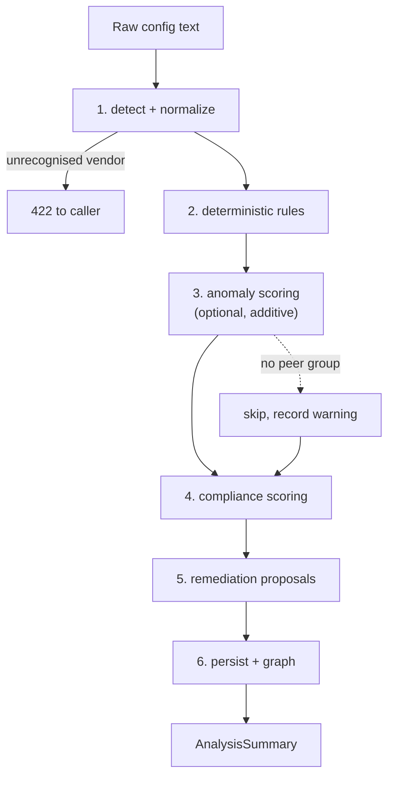
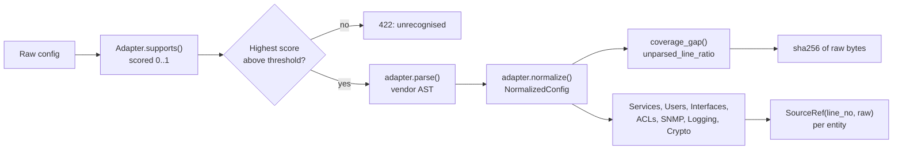
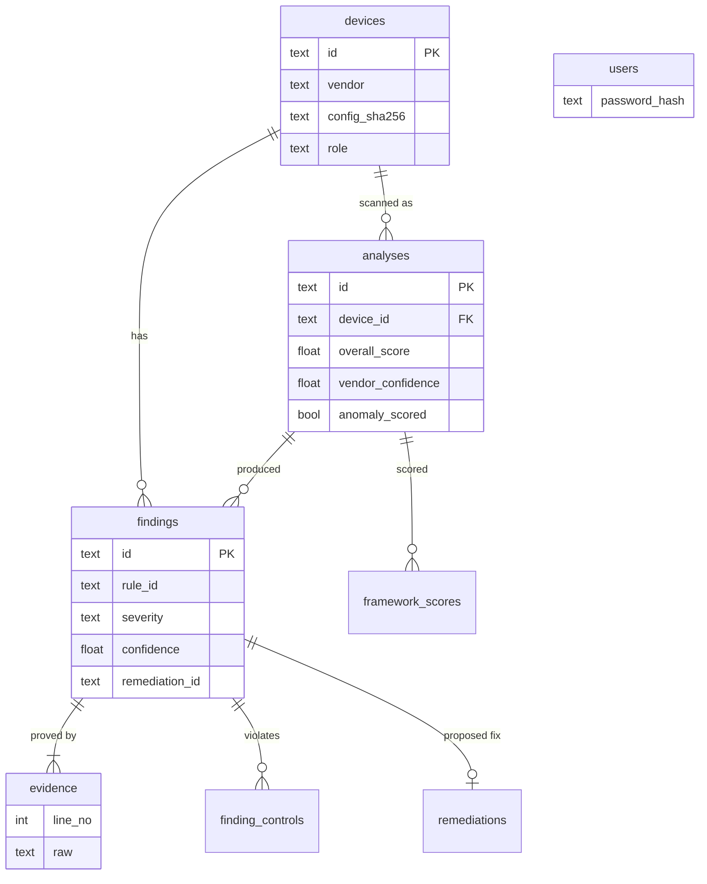
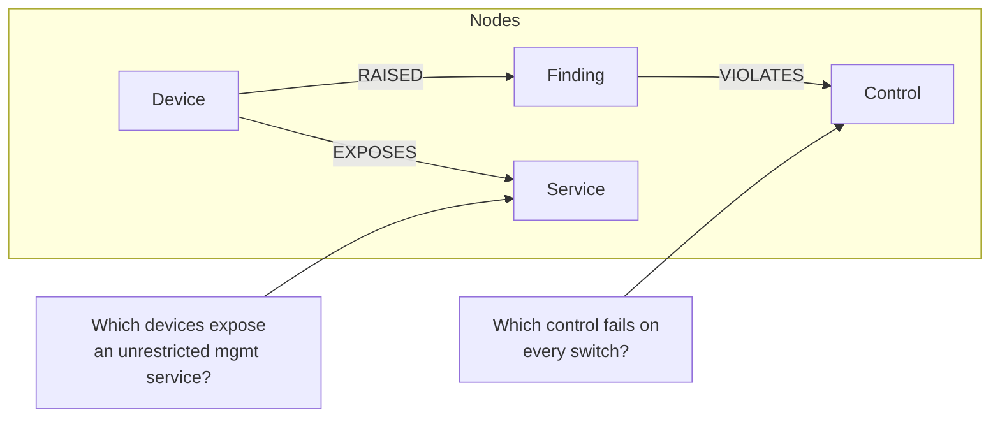

# NETGUARD-AI -- Architecture

Assessment of network device configurations against CIS benchmarks, with
evidence, compliance scoring, unsupervised anomaly detection and human-reviewed
remediation proposals.

> **NETGUARD-AI assesses and proposes. It never applies changes to a device.**
> There is no endpoint, CLI flag, or background job that pushes a command to
> network hardware. Remediation output is a review queue.

---

## 1. System overview



The service is usable with **neither** Postgres nor Neo4j running. Degradation is
reported explicitly rather than hidden -- see [§6](#6-degradation-behaviour).

---

## 2. Analysis pipeline

Stage order is a correctness requirement, not a preference.



**1. Normalize.** Vendor adapters score the raw text and the best match wins
(`app/normalize/base.py:NormalizerRegistry.detect`). The adapter produces a
`NormalizedConfig`: a vendor-neutral entity graph (users, services, interfaces,
ACLs, SNMP communities, logging, crypto) with a `SourceRef` back to the exact
line that produced each entity.

**2. Rules.** 22 rules across `app/analysis/rules/`. Each returns
`list[RuleOutcome] | None` -- never a bare value -- so `PASS`, `FAIL`,
`NOT_APPLICABLE` and `INDETERMINATE` are all first-class. Only `FAIL` becomes a
`Finding`. A rule that raises is caught and recorded as `INDETERMINATE`; one bad
rule cannot fail a scan.

**3. Anomaly.** `app/analysis/anomaly.py` scores a device against a peer-group
baseline of median and median-absolute-deviation, plus a k-NN distance term. The
device being scored is **never** in its own training set -- a device is always
its own nearest neighbour, which would make every scan look normal.

`IsolationForest` was the first choice and was rejected: its `contamination`
parameter forces an anomaly *rate* to be invented before the data has been seen.
Median/MAD needs no such prior and degrades to an honest "not enough peers"
message instead of a confident wrong answer.

**4. Compliance.** `app/analysis/compliance.py` scores severity-weighted pass
rates per framework, restricted to frameworks that apply to the device's vendor.
Scoring a Cisco switch against "CIS Fortinet" would not be useless, it would be
actively misleading in an audit.

Each score carries `sufficient_evidence`. A framework that could only assess two
controls reports `0.00%` alongside that flag, and the UI renders it differently.
A score derived from almost no evidence is not the same claim as a score derived
from a full read.

**5. Remediation.** `app/remediation/generator.py` maps rule IDs to handlers.
Findings with no handler get no plan: an unspecific "review your logging
configuration" reads like guidance while changing nothing, which is worse than
saying nothing.

**6. Side effects.** Persistence and graph writes happen last. A failure there
never invalidates the analysis -- it downgrades it to "computed but not stored",
which the response reports.

---

## 3. Vendor normalization



`unparsed_line_ratio` is measured *after* normalization, because that is the only
point where we know which lines actually became entities. It is the honest
confidence signal: a parser that silently ignores a config section shows a high
gap, and the dashboard lowers its trust in the score rather than reporting a
clean bill of health we did not earn.

`raw_config_sha256` is computed in `VendorNormalizer.run` -- the only place both
the raw upload and the finished config are in scope -- so an auditor can prove
which file produced a finding.

### Secret handling

Redaction happens during normalization, before anything is stored, logged,
returned or scored:

| Pattern | Replaced with |
| --- | --- |
| `secret` / `password` values | `REDACTED` |
| SNMP community strings | `public` |
| Username passwords | `REDACTED` |

PAN-OS XML is parsed with `defusedxml`, not `xml.etree`. Uploaded device configs
are untrusted input.

---

## 4. Data model



Design decisions worth stating:

- **Row-per-finding, not JSON blobs.** Auditors filter by severity, vendor and
  control across devices, so those are real indexed columns.
- **Evidence is relational and verbatim** (already redacted), so a finding can be
  proved long after the upload is gone.
- **No cascade delete from `devices`.** Deleting a device must be an explicit,
  reversible act; foreign keys refuse the delete and force a decision.
- **Re-uploading creates a new `analyses` row.** History is append-only.

---

## 5. Security knowledge graph

Rules see one device. The graph sees the fleet.



`app/db/graph.py` uses MERGE-only writes. Nothing in that module DELETEs, because
a shared resource node may legitimately belong to a device whose row we have not
seen yet.

`app/db/repository.py` is the single place where domain objects become rows, so
every persistence decision is reviewable in one file.

---

## 6. Degradation behaviour

Running with no database is a supported mode, not a failure mode.

| Dependency | Unavailable behaviour |
| --- | --- |
| Postgres | Scans work. `/analyses`, `/devices`, `/remediations` return **503**. `/dashboard` returns zeros plus the reason. |
| Neo4j | Graph endpoints return `{"available": false, "reason": ...}`. Analysis is unaffected. |
| Peer group for ML | Anomaly stage skipped; warning recorded on the result. |

The distinction that matters throughout: **"there are no results" is not "we
cannot tell".** Empty lists are only returned when the query genuinely ran.

`/healthz` is a liveness probe and touches no dependency, so a database outage
cannot remove the service from a load balancer. `/readyz` reports what is
degraded and requires only the pipeline.

---

## 7. API surface

| Method | Path | Auth | Purpose |
| --- | --- | --- | --- |
| GET | `/healthz` | none | liveness |
| GET | `/readyz` | none | readiness + degradation detail |
| POST | `/auth/login` | none | exchange credentials for a JWT |
| GET | `/auth/me` | bearer | current identity |
| GET | `/vendors` | bearer | supported adapters + rule packs |
| POST | `/analyze` | analyst | scan an uploaded config |
| GET | `/analyses` | analyst | scan history |
| GET | `/analyses/{id}` | analyst | one scan |
| GET | `/dashboard` | analyst | fleet rollup |
| GET | `/devices` | analyst | device inventory |
| GET | `/remediations` | analyst | review queue |
| POST | `/remediations/{id}/review` | analyst | approve / reject |
| GET | `/graph/exposed-services` | analyst | cross-device reachability |

There is deliberately **no** `apply` route. `tests/test_api.py::TestSafetySurface`
asserts this by scanning the generated OpenAPI schema for such a path.

### Request handling

- **JWT (HS256)**, role read from the token, never from a request body or header.
  A viewer cannot escalate by sending `X-Role: admin`.
- **Passwords** hashed with Argon2id (scrypt fallback). Login failures are
  identical for unknown user and wrong password, and a verification always runs,
  so response latency cannot enumerate usernames.
- **Uploads** capped in size and restricted by suffix. The body is read one byte
  past the cap so an oversized upload is rejected rather than silently truncated
  into a config that parses as something else.
- **Security headers** on every response: strict CSP, `nosniff`, `DENY` framing,
  `no-store`. Findings contain attacker-influenceable text.
- **Unhandled errors** return `{"detail": "internal error", "request_id": ...}`.
  The stack trace goes to the log; the client gets a correlation id.

---

## 8. Test strategy

312 tests, no network or database server required.

| Suite | Covers |
| --- | --- |
| `test_normalize*.py` | adapters, coverage, redaction, provenance |
| `test_rules.py` | all 22 rules, vendor gating, ordering |
| `test_compliance.py` | scoring, insufficient-evidence handling |
| `test_anomaly.py` | MAD stability, constant features, peer isolation |
| `test_remediation.py` | handler safety, no secret leakage, no auto-apply |
| `test_persistence.py` | ORM round-trip on in-memory SQLite, constraints |
| `test_pipeline.py` | stage ordering, degradation, ML integration |
| `test_api.py` | auth, roles, upload limits, degraded DB, no apply route |

`tests/test_persistence.py` runs against SQLite rather than Postgres
deliberately: the schema uses no Postgres-only types, and a suite needing a
running server is a suite nobody runs before committing.

---

## 9. Layout

```
backend/app/
  main.py                  ASGI factory, middleware
  core/          config, security primitives, structured logging
  normalize/     models, base adapter contract, registry, adapters/
  analysis/      rule_packs, compliance, anomaly, rules/
  remediation/   generator
  pipeline/      orchestrator
  db/            models (SQLAlchemy), session, repository, graph (Neo4j)
  schemas/       API contracts
  api/           deps, v1/endpoints/
```